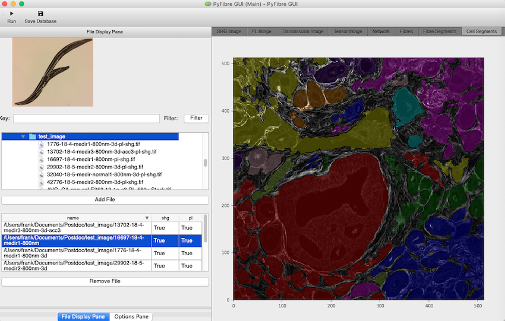

# PyFibre

PyFibre is an open source image analysis toolkit for fibrous tissue that can be run either in a terminal or GUI. It is designed to make the quantification of fibrous tissue automated, standardised and efficient whilst remaining as transparent as possible for non-technical users.
 

## Installation

PyFibre is deployed using Enthought Deployment Manager, 
[EDM](https://www.enthought.com/product/enthought-deployment-manager/). 
Please download and install
the latest version prior to continuing further. 

Once installed, simply create a default environment using the command line:

    edm install --version 3.6 -y click setuptools
    edm shell

Then build the deployment `PyFibre-py36` environment using the following command:

    python -m ci build-env

Afterwards, install a package egg with all binaries using:

    python -m ci install

This will install all required libraries and create the local `PyFibre` and `PyFibre_GUI` binaries.
To make sure the installation has been successful, please run the unittests

    python -m ci test

And create the documentation

    python -m ci docs

## Running the PyFibre GUI

Once installed, enter the deployment environment using

    edm shell -e PyFibre-py36

and call the executable `PyFibre_GUI` from the command line to initiate the graphical user interface.

### File Viewer

PyFibre is set by default to detect Tagged Image Format (tif) files. To load in individual files to analyse, use the filwindow to navigate through your file treethe `Add Files` button and . Alternatively, you can load in all tif files within a single directory by using the `Load Folder` button.

#### Automatic SHG and PL Image Detection

If you have performed multiple imaging techniques on the same region, then PyFibre is able to take advantage of this to provide extra analysis. Currently both Second Harmonic Generation (SHG) and Photoluminescence (PL) imaging techniques are supported. 

Loading images containing the keyword `SHG` or `PL` in the file path (see below) will allow PyFibre automatically match these up based on the `{prefix}`.

	{directory}/{prefix}-{keyword}{suffix}.tif

The files will then appear as:

	{directory}/{prefix}
	
#### File Management

Once loaded, the files are visible in a scrollable list on the left hand side. They can be removed from here at any 
time by highlighting and clicking the `Delete` button, or automatically filtered for keywords using the `Filter` entry form. 

#### Running Analysis

Clicking the `Run` button at the bottom will begin a batch analysis of all the files listed within the box at the 
time of execution. This can be interrupted at any point using the `Stop` button.

### Image Viewer

The image display notebook on the right hand side of the GUI is able to show both the original images as well as results of PyFibre's analysis.

Tab | Description
--- | ---
SHG Image | Greyscale SHG image
PL Image | Greyscale PL image
Trans Image | Greyscale Transmission image
Tensor Image | RGB image, using hue, saturation and brightness based on pixel structure tensor
Network | Greyscale SHG image with overlayed FIRE networks
Network Segment | Greyscale SHG image with overlayed segmented regions base on position of FIRE networks
Fibre | Greyscale SHG image with overlayed individual fibres extracted from FIRE networks
Cell Segment| Greyscale PL image with overlayed segmented regions base on position of cellular regions
Metrics | List of measured properties for SHG and PL images

## Running in the Terminal

Calling the executable `PyFibre` from the command line will initiate the terminal based version of PyFibre.

	Usage: PyFibre [OPTIONS] [FILE_PATH]

    Options:
      --version             Show the version and exit.
      --debug               Prints extra debug information in
                            pyfibre.log
      --profile             Run GUI under cProfile, creating .prof and
                            .pstats files in the current directory.
      --shg_analysis        Toggles analysis of SHG images
      --pl_analysis         Toggles analysis of PL images
      --ow_metric           Toggles overwrite analytic metrics
      --ow_segment          Toggles overwrite image segmentation
      --ow_network          Toggles overwrite network extraction
      --save_figures        Toggles saving of figures
      --test                Perform run on test image
      --key TEXT            Keywords to filter file names
      --sigma FLOAT         Gaussian smoothing standard deviation
      --alpha FLOAT         Alpha network coefficient
      --database_name TEXT  Output database filename
      --log_name TEXT       Pyfibre log filename
      --help                Show this message and exit.
    
        

## Metrics

PyFibre calculates properties for the global images and each segmentd region. The resultant databases for each section are then labelled:

	{directory}/data/{prefix}_global_metric.h5 = global image output (also in .xls format)
	{directory}/data/{prefix}_fibre_metric.h5 = fibre segmented image output (also in .xls format)
	{directory}/data/{prefix}_cell_metric.h5 = cell segmented image output (also in .xls format)

Each database has the following columns:

Metric | Description | Category
--- | --- | ---
No. Fibres | Number of extracted fibres | Network
No. Cells | Number of cell segments | Content
Angle SDI | Angle spectrum SDI (mean / max) for all image pixels| Texture
Anisotropy | Anisotropy of structure tensor for total image/segment | Texture
Pixel Anisotropy | Mean anisotropy of structure tensor for all image pixels | Texture
Intensity Mean | Mean pixel intensity of total image/segment | Texture
Intensity STD | Standard deviation of pixel intensity of total image/segment | Texture
Intensity Entropy | Average Shannon entropy of pixel intensities of total image/segment | Texture
GLCM Contrast | GLCM angle-averaged contrast of segment| Texture
GLCM Homogeneity | GLCM angle-averaged homogeneity of segment| Texture
GLCM Dissimilarity | GLCM angle-averaged dissimilarity of segment| Texture
GLCM Correlation | GLCM angle-averaged correlation of segment| Texture
GLCM Energy | GLCM angle-averaged energy of segment| Texture
GLCM IDM | GLCM angle-averaged inverse difference moment of segment| Texture
GLCM Variance | GLCM angle-averaged variance of segment | Texture
GLCM Cluster | GLCM angle-averaged clustering tendency of segment | Texture
GLCM Entropy | GLCM angle-averaged entropy of segment | Texture
Area | Average number of pixels covered by segment | Content
Coverage | Ratio of segment covered by fibres or cells  | Content
Linearity | Average segment linearity | Shape
Eccentricity | Average segment eccentricity | Shape
Density | Average image segment density | Texture
Hu Moment 1 | Average segment Hu moment 1 | Shape
Hu Moment 2 | Average segment Hu moment 2 | Shape
Network Degree | Average fibre network number of edges per node | Network
Network Eigenvalue | Max eigenvalue of network adjacency matrix| Network
Network Connectivity | Average fibre network connectivity | Network
Fibre Waviness | Average fibre waviness (length / displacement) | Content
Fibre Lengths | Average fibre pixel length | Content
Fibre Cross-Link Density | Average cross-links per fibre | Content
