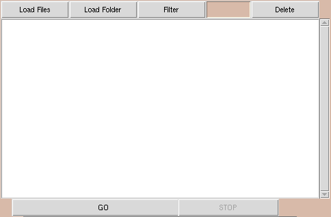
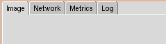

# PyFibre

PyFibre is an open source image analysis toolkit for fibrous tissue that can be run either in a terminal or GUI. It is designed to make the quantification of fibrous tissue automated, standardised and efficient whilst remaining as transparent as possible for non-technical users.
 

Installation
------

PyFibre requires a local distributions of python >= 3.6 and pip >= 9.0 in order to run. Either [anaconda](https://www.anaconda.com/download/) or [miniconda](https://conda.io/miniconda.html) distributions are recommended.

The use of a virtual environment, such as [conda](https://conda.io/docs/), is optional, but also recommended. If using anaconda or miniconda python distribution, this can be easily initiated set up using the commands:

`conda create -n PyFibre python=3.6`

`source activate PyFibre`

Once a suitable distribution of python is installed, download the Pyfibre repository and run `make` in the PyFibre directory. This will install all required libraries and create the local `PyFibre` and `PyFibre_GUI` binaries.

Running the PyFibre GUI
----

Once installed, calling the executable `PyFibre_GUI` from the command line will initiate a graphical user interface.

PyFibre is set by default to detect Tagged Image Format (tif) files. To load in individual files to analyse, use the `Load Files` button and use the pop up window to navigate through your file tree. Alternatively, you can load in all tif files within a single directory by using the `Load Folder` button.

Once loaded, the files are visible in a scrollable list on the left hand side. They can be removed from here at any time by highlighting and clicking the `Delete` button, or automatically filtered for keywords using the `Filter` entry form. 

Clicking the `GO` button at the bottom will begin a batch analysis of all the files listed within the box at the time of execution. This can be interrupted at any point using the `STOP` button.

The data viewer notebook on the right hand side of the GUI can display individual images as well as overlay the extracted fibre network once complete. There is also a tab to display a dashboard of metrics for the selected images in the file list.

### --- (Under Development) ---

Running in the Terminal
----

Calling the executable `PyFibre` from the command line will initiate the terminal based version of PyFibre.

Metrics
----

	Image Anisotropy : Anisotropy of nematic tensor for whole image
	Pixel Anisotropy : Average anisotropy of nematic tensor for each pixel in the image
	Network Clustering : Clustering coefficient of extracted fibre network
