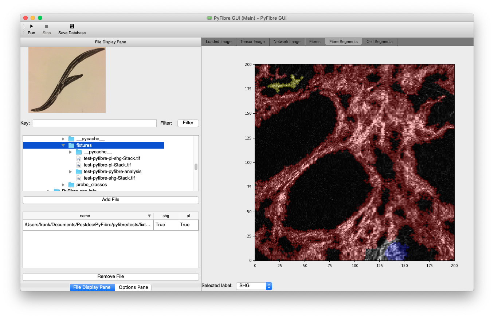

Running the PyFibre GUI
-----------------------

Once installed, enter the PyFibre deployment environment using::

    python -m ci shell

and call the executable ``PyFibre_GUI`` from the command line to initiate the graphical user interface.

File Viewer
~~~~~~~~~~~

PyFibre is set by default to detect Tagged Image Format (TIF) files. To load in individual files to analyse, use the
file window to navigate through your file tree and the 'Add Files' button to load in files or folders into the
software.

File Management
~~~~~~~~~~~~~~~

Once loaded, the files are visible in a scrollable list on the left hand side. They can be removed from here at any
time by highlighting and clicking the 'Delete' button, or automatically filtered for keywords using the 'Filter' entry form.

Running Analysis
~~~~~~~~~~~~~~~~

Clicking the 'Run' button at the bottom will begin a batch analysis of all the files listed within the box at the
time of execution. This can be interrupted at any point using the 'Stop' button.

Saving Databases
~~~~~~~~~~~~~~~~

The 'Save Database' icon brings up a file window in which to save a collated copy of all loaded image metrics.

Image Viewer
~~~~~~~~~~~~

The image display notebook on the right hand side of the GUI is able to show both the original images as well as
results of PyFibre's analysis.

.. csv-table:: Image Viewer
    :header: "Tab", "Description"
    :widths: 15, 30

    "Loaded Image", "Grey-scale multi-channel image"
    "Tensor Image",  "RGB multi-channel image, using hue, saturation and brightness based on pixel structure tensor"
    "Network", "Grey-scale multi-channel image with over-layed FIRE networks"
    "Fibre",  "Grey-scale multi-channel image with over-layed individual fibres extracted from FIRE networks"
    "Fibre Segment",  "Grey-scale multi-channel image with over-layed segmented regions base on position of FIRE networks"
    "Cell Segment", "Grey-scale multi-channel image with over-layed segmented regions base on position of cellular regions"
    "Metrics",  "List of measured properties for multi-channel image"
